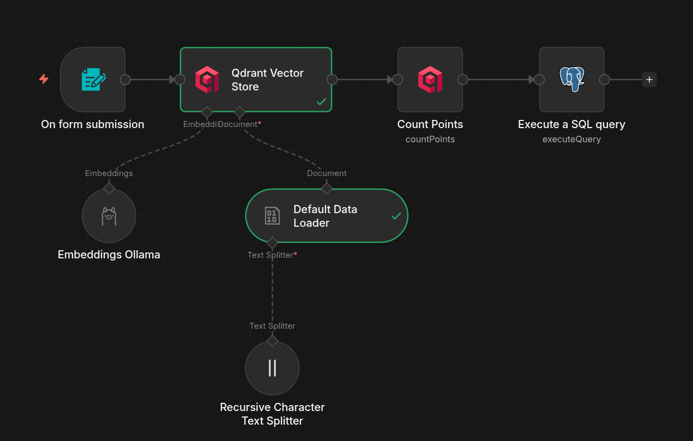
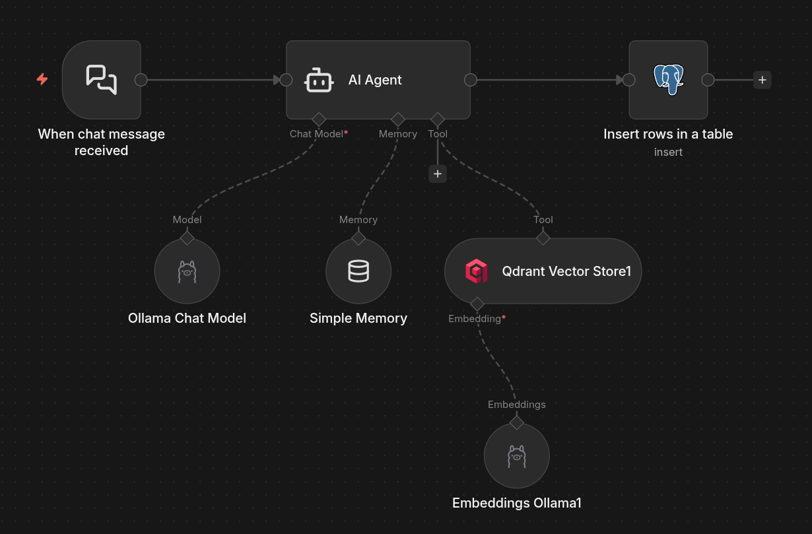
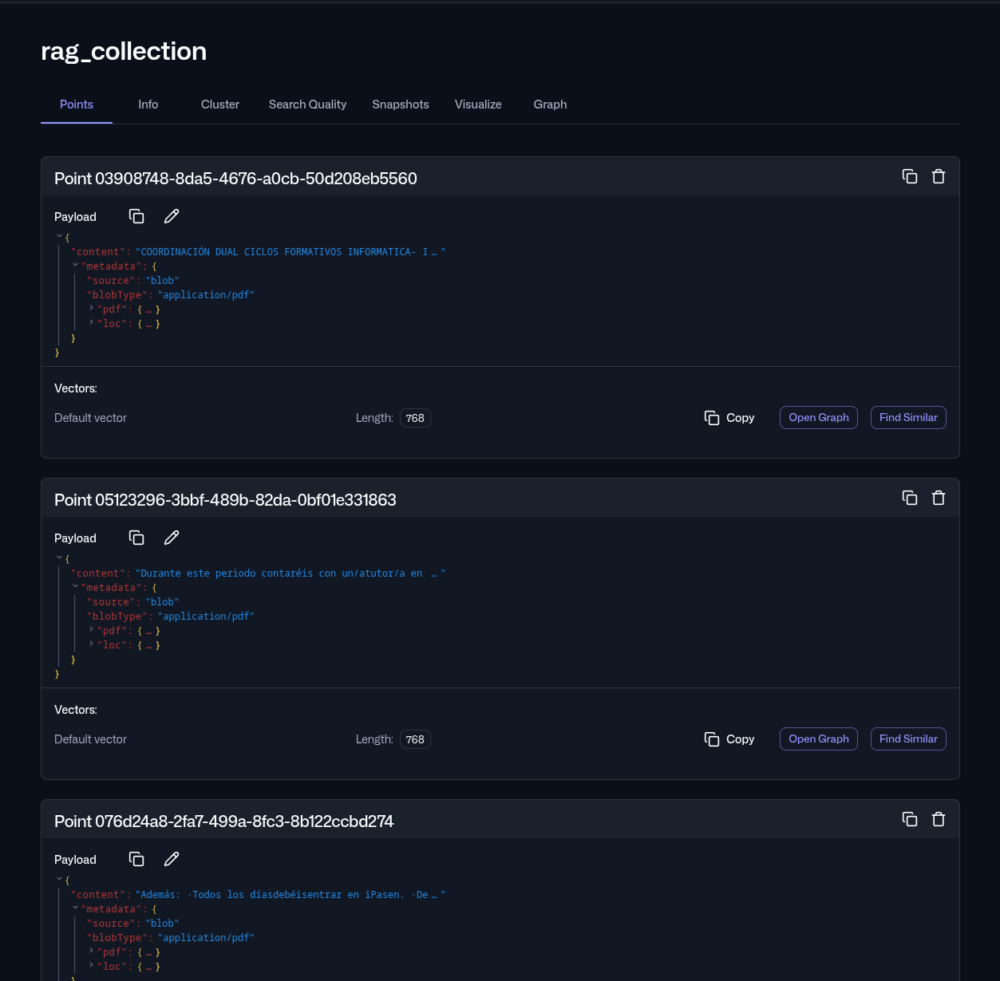
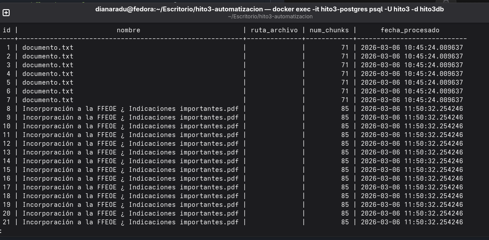
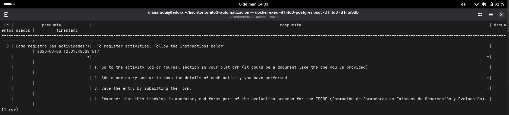
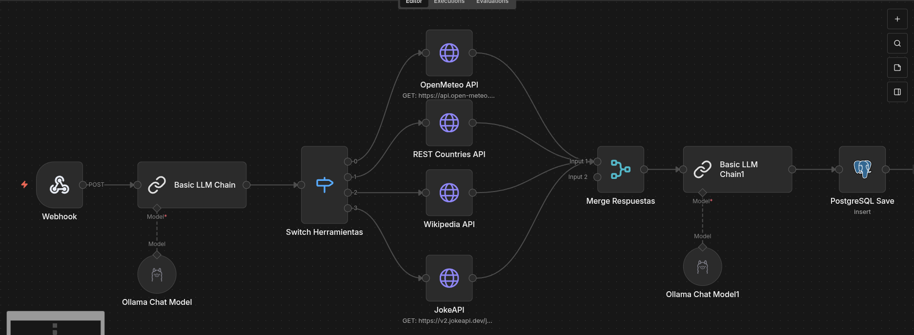
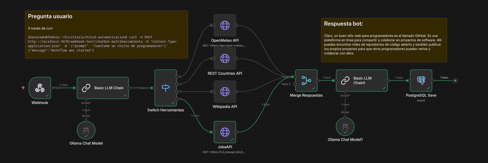
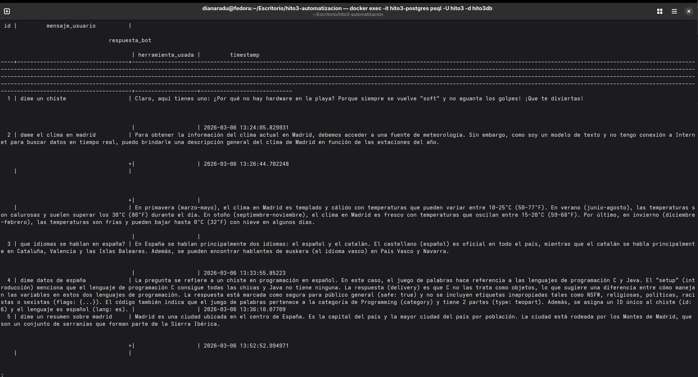
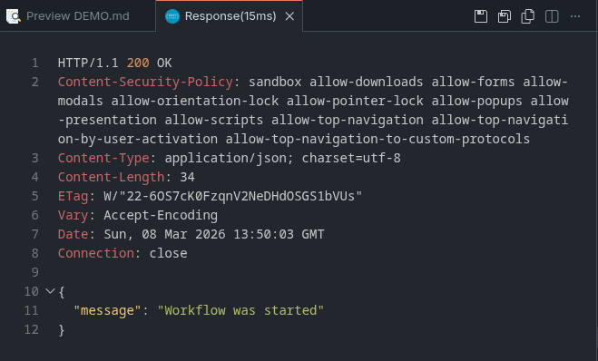
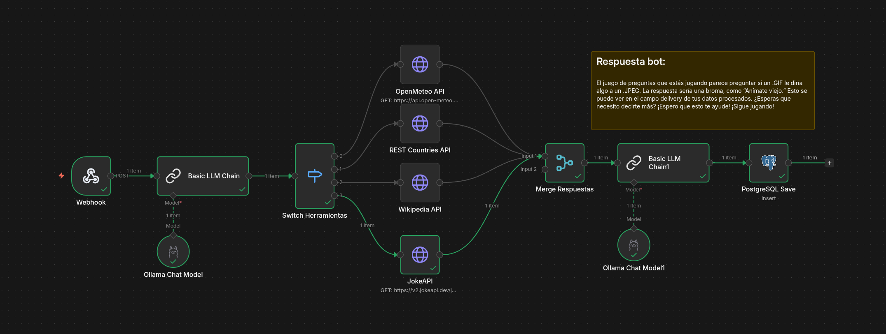

# 📖 Documentación de Pruebas y Demostración - HITO 3

Este documento detalla el funcionamiento técnico, las pruebas de integración y la validación de datos para los dos sistemas de IA desarrollados.

---

## 🏗️ Arquitectura de Integración

El ecosistema se despliega mediante **Docker Compose**, garantizando que todos los servicios se comuniquen en una red aislada:

- **Orquestación:** n8n (Webhook ↔️ Logic ↔️ Storage).
- **Cerebro IA:** Ollama (Modelos: `mistral` para razonamiento y `nomic-embed-text` para vectores).
- **Memoria Semántica:** Qdrant (Base de datos vectorial).
- **Memoria Estructurada:** PostgreSQL (Persistencia de logs y metadatos).

---

## 📚 Proyecto A: Sistema RAG Educativo

El objetivo es permitir que la IA responda basándose exclusivamente en documentos proporcionados, evitando "alucinaciones".

### 1.1. Workflow de Ingesta (Documentos a Vectores)

Este flujo procesa archivos y los prepara para la búsqueda semántica.

- **Proceso:** Recepción de archivo → Split de texto → Embedding → Upsert en Qdrant → Count points → Insertar en BD .



> **Nota Técnica:** Se ha configurado un _overlap_ de 50 para no perder el contexto entre fragmentos adyacentes durante la división del texto.

### 1.2. Workflow de Consulta

El usuario pregunta y el sistema recupera el contexto antes de generar la respuesta.



### 1.3. Evidencias de Almacenamiento

Para verificar que el RAG funciona, mostramos los datos en las bases de datos:

- **Qdrant UI:** Captura de los puntos (vectores) creados en la colección `rag_collection`.

  

- **PostgreSQL:** Resultado de `SELECT * FROM documentos;` mostrando el conteo de chunks procesados.

  
  

---

## 💬 Proyecto B: Chatbot Multiherramienta

Un agente inteligente que decide en tiempo real qué herramienta usar según el mensaje del usuario.

### 2.1. Análisis de Intención

Utilizamos un nodo de Ollama con un prompt de sistema que obliga al modelo a clasificar la consulta en una de las 5 rutas: `clima`, `paises`, `wiki`, `chiste` o `general`.



### 2.2. Integración de APIs (Sin Key)

Se han testeado con éxito las siguientes integraciones:

1. **OpenMeteo:** Obtención de temperatura actual por coordenadas.
2. **REST Countries:** Datos de población y capitales.
3. **Wikipedia:** Resúmenes de artículos técnicos/históricos.
4. **JokeAPI:** Generación de chistes para programadores.

### 2.3. Ejemplo de Interacción Natural

- **Usuario:** "Cuéntame un chiste de programadores"
- **Respuesta Bot:** Claro, un buen sitio web para programadores es el llamado GitHub. Es una plataforma en línea para compartir y colaborar en proyectos de software. Allí puedes encontrar miles de repositorios de código abierto y también publicar tus propios proyectos para que otros programadores puedan verlos y colaborar con ellos.

## 

## 💾 Persistencia en PostgreSQL

Es vital demostrar que los datos se guardan correctamente para auditoría o re-entrenamiento.

| Tabla               | Propósito                                         | Estado       |
| ------------------- | ------------------------------------------------- | ------------ |
| `documentos`        | Tracking de archivos subidos y fecha.             | ✅ Operativa |
| `consultas_rag`     | Registro de preguntas y qué documentos se usaron. | ✅ Operativa |
| `historial_chatbot` | Log de interacciones y decisiones del agente.     | ✅ Operativa |



---

## 🧪 Pruebas de Estrés (Testing)

Hemos utilizado el archivo `tests/pruebas.http` para validar los endpoints de los Webhooks de n8n.

### Test de Consulta Chatbot

```http
POST {{baseUrl}}/chatbot-multiherramienta
Content-Type: application/json

{
  "mensaje": "Estoy aburrido, cuéntame un chiste de programadores.",
  "sesion_id": "chat_001"
}
```




---

## 🏁 Conclusión

El sistema es capaz de manejar flujos de datos no estructurados (PDFs) y estructurados (APIs) de forma autónoma. La combinación de **n8n como orquestador** y **Ollama como motor de razonamiento local** permite crear aplicaciones de IA potentes, privadas y escalables.
